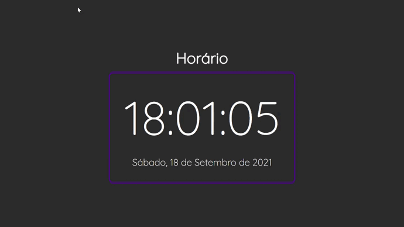

# Mini Projetos com javascript puro
  Objetivo

Não tem outra maneira para se aprender além de praticar, praticar e praticar.

Pensando nisso, eu criei este repositório com objetivo juntar ideias de mini projetos em JavaScript para eu poder práticar e poder aprender ainda mais.

espero que gostem 😊👨‍💻

<table border="2">
  <tr>
    <td>
        <h3>00 - Lâmpada</h3>
        <li><a href="https://github.com/nomegustaa/Desenvolvimento-Js/tree/main/001-l%C3%A2mpada"> Código</a></li> 
        
    </td>
    <td>
        <h3>01 - Horário em tempo real</h3>
        <li><a href="https://github.com/nomegustaa/Desenvolvimento-Js/tree/main/002-Hor%C3%A1rio"> Código</a></li> 
        
    </td>
  </tr>
  
</table>
