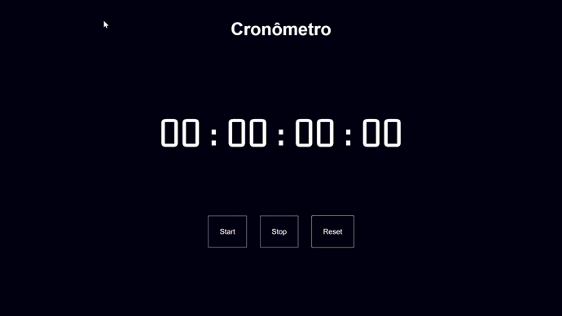
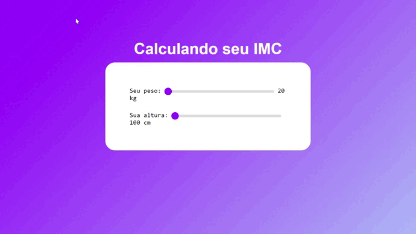
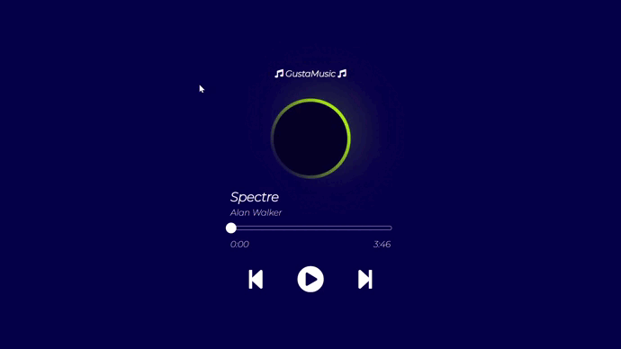

# Mini Projetos com JavaScript puro
  
  Objetivo

Não tem outra maneira para se aprender além de praticar, praticar e praticar.

Pensando nisso, eu criei este repositório com objetivo juntar ideias de mini projetos em JavaScript para poder práticar e também aprender ainda mais.

espero que gostem.👨‍💻

<table border="1">
  <tr>
    <td>
        <h3>01 - Lâmpada</h3>
        <li><a href="https://github.com/nomegustaa/Desenvolvimento-Js/tree/main/01%20-%20L%C3%A2mpada"> Código</a></li> 
        
    </td>
    <td>
        <h3>02 - Horário em tempo real</h3>
        <li><a href="https://github.com/nomegustaa/Desenvolvimento-Js/tree/main/02%20-%20Hor%C3%A1rio"> Código</a></li> 
        
    </td>
       <td>
        <h3>03 - Cronômetro</h3>
        <li><a href="https://github.com/nomegustaa/Desenvolvimento-Js/tree/main/03%20-%20Cron%C3%B4metro"> Código</a></li> 
        
      </td>
  </tr>
  <tr>
    <td>
      <h3>04 - Calculadora de IMC</h3>
      <li><a href="https://github.com/nomegustaa/Desenvolvimento-Js/tree/main/04%20-%20Calculando%20o%20imc"> Código</a></li> 
      
    </td>
    <td>
      <h3>05 - Player de música</h3>
      <li><a href="https://github.com/nomegustaa/Desenvolvimento-Js/tree/main/05%20-%20PlayM%C3%BAsic">Código</a> </li> 
      
    </td>
  </tr>
  
</table>

 ##
